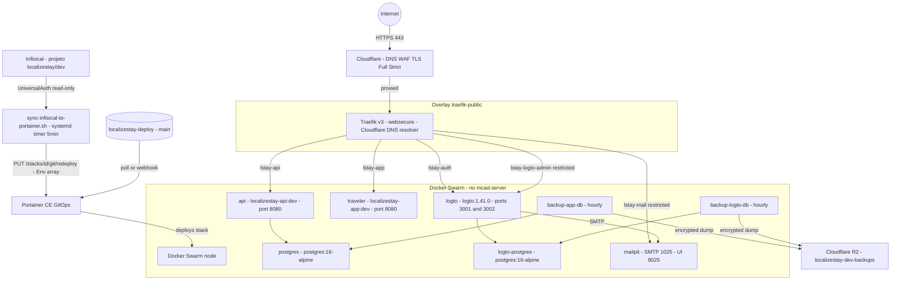

# localizestay-deploy

Repositório GitOps de deploy da **LocalizeStay**. Contém as stack files do
Docker Swarm por ambiente (`envs/dev`, `envs/homolog`, `envs/prod`) e é a
**única fonte de verdade de deploy**, observada em modo GitOps pelo
**Portainer CE** rodando no `mcad-server`. Não contém código de aplicação
(este vive em `localizestay-backend` e `localizestay-frontend`) nem
segredos (vivem no Infisical) — ver ADR-0009 em `viajora-meta`.

Só `envs/dev/` está implementado hoje. `envs/homolog/` e `envs/prod/` são
placeholders — ver os READMEs de cada um para o porquê e as pré-condições.

## Diagrama da stack `dev`



Regras duras aplicadas em todo o diagrama (ADR-0004): nenhum serviço
publica `ports:` no host; `postgres` e `logto-postgres` nunca tocam
`traefik-public`; toda exposição HTTP passa por labels do Traefik.

## Hosts / DNS a criar na Cloudflare (`dev`)

Todos de **nível único** (o certificado Universal SSL da Cloudflare cobre só
um nível de wildcard) sob `tasso.dev.br`, **proxied** (nuvem laranja) e com
**TLS Full (Strict)** na aba SSL/TLS da zona (nunca Flexible — ADR-0004).

| Host | Aponta para | Serviço/porta interna | Proxied | Acesso |
|---|---|---|---|---|
| `lstay-app.tasso.dev.br` | IP do `mcad-server` | `traveler:8080` | Sim | Público |
| `lstay-api.tasso.dev.br` | IP do `mcad-server` | `api:8080` | Sim | Público |
| `lstay-auth.tasso.dev.br` | IP do `mcad-server` | `logto:3001` | Sim | Público (login) |
| `lstay-logto-admin.tasso.dev.br` | IP do `mcad-server` | `logto:3002` | Sim | Restrito (`ipAllowList`) |
| `lstay-mail.tasso.dev.br` | IP do `mcad-server` | `mailpit:8025` | Sim | Restrito (`ipAllowList`) |

Registro tipo `A` (ou `CNAME` se o `mcad-server` já tiver um hostname
canônico na zona) apontando para o IP público do `mcad-server`. Certificado
emitido sob demanda pelo `cloudflare-resolver` (DNS-01) já configurado no
Traefik do host — nenhuma ação adicional de emissão manual de certificado.

## Configuração do GitOps no Portainer CE

1. **Portainer → Stacks → Add stack.**
2. **Build method: Repository.**
   - Repository URL: URL deste repositório (`localizestay-deploy`).
   - Repository reference: `refs/heads/main`.
   - Compose path: `envs/dev/localizestay.stack.yml`.
   - Se o repositório for privado, configurar credenciais de acesso Git no
     próprio formulário (PAT do GitHub).
3. **Environment variables:** os pares `${VAR}` listados em
   `envs/dev/SECRETS.md` são preenchidos automaticamente pelo script
   `scripts/sync-infisical-to-portainer.sh` (systemd timer no host, ver
   `envs/dev/SECRETS.md` para o mecanismo completo e o setup único de
   credenciais) — não é mais colagem manual. Na criação inicial da stack,
   ainda é preciso configurar as credenciais desse script uma vez (Infisical
   machine identity + Portainer API token) antes do primeiro sync.
4. **GitOps updates:** habilitar. Duas opções, não mutuamente exclusivas:
   - **Polling:** Portainer verifica o repositório em um intervalo
     configurável (ex.: a cada 5 min) e reaplica a stack se o commit em
     `main` mudou.
   - **Webhook:** Portainer expõe uma URL de webhook para esta stack; um
     `POST` nela força o re-pull/redeploy imediato. É o mecanismo indicado
     para reagir rápido a promoções de imagem.
5. **Deploy the stack.**

### Como o CI dos apps aciona o redeploy

Fluxo (ADR-0009): push/merge em `localizestay-backend` ou
`localizestay-frontend` → GitHub Actions builda, testa e publica a imagem no
GHCR com tag imutável (`sha-<hash>`) + tag de ambiente (`:dev`). Como as
labels do serviço `api`/`traveler` neste repositório usam a tag de ambiente
mutável (`:dev`), o job de CI, após o push da imagem, chama o **webhook do
Portainer** desta stack (URL gerada no passo 4 acima, guardada como secret
do repositório de app) para forçar o Portainer a puxar a imagem `:dev`
recém-publicada e recriar o serviço. Esse é o mecanismo definido nesta
etapa; o `secret` do webhook em si não pertence a este repositório.

Alternativa prevista no ADR-0009 (não implementada aqui): o CI, em vez de
usar tag mutável + webhook, faz um commit automatizado neste repositório
atualizando a tag de imagem para o `sha-<hash>` imutável — nesse caso o
polling do Portainer já é suficiente, sem precisar de webhook. Qual das
duas abordagens vira padrão é decisão da implementação do pipeline de CI,
fora do escopo deste repositório de deploy.

## Seed inicial do LogTo

Depois do primeiro `docker stack deploy` bem-sucedido (serviço `logto` no
ar, `logto-postgres` saudável), rodar o seed do banco **uma única vez**,
antes de considerar o LogTo pronto para uso:

```bash
# Descobrir o container do serviço logto no nó
docker ps --filter "name=<stack>_logto" --format '{{.ID}}'

# Executar o seed dentro do container (task única, controlada)
docker exec -it <container_id> npm run cli db seed -- --swe
```

`--swe` inicializa o schema com os dados semente recomendados pela doc
oficial do LogTo. Rodar novamente contra um banco já semeado não é seguro —
só na primeira subida do `logto-postgres` vazio. Depois do seed, seguir o
checklist de modelagem de identidade em
`viajora-meta/docs/setup-logto.md` (API Resource, aplicações, roles,
sign-in experience, connector SMTP para o Mailpit).

## Rollback

O histórico deste repositório **é** a trilha de auditoria de deploy
(ADR-0009): não existe rollback "no servidor", só rollback via Git.

1. Identificar o commit bom anterior em `main` (`git log --
   envs/dev/localizestay.stack.yml`).
2. `git revert <commit-problemático>` (preferível a `reset --hard`, preserva
   histórico) ou abrir PR revertendo a mudança.
3. Merge em `main`.
4. Portainer reaplica automaticamente (polling) ou disparar o webhook /
   clicar em "Pull and redeploy" manualmente na stack para não esperar o
   intervalo de polling.
5. Se o problema foi uma imagem `:dev` ruim (não uma mudança de stack file),
   o rollback é publicar/promover a imagem anterior e repetir o redeploy —
   a stack file em si pode não ter mudado.

## Regras duras (não negociáveis, verificadas em revisão de PR)

- **Nenhum serviço publica `ports:`** no host. Toda exposição HTTP é via
  labels do Traefik na rede `traefik-public` (ADR-0004).
- **Nenhum segredo real neste repositório**, em nenhum arquivo, commit ou
  histórico. Só placeholders `${VAR}` documentados — ver
  `envs/dev/SECRETS.md`.
- `postgres` e `logto-postgres` só existem em `localizestay-internal`,
  nunca em `traefik-public`.
- Imagens de peças de segurança (LogTo) usam **versão fixada**, nunca
  `:latest` (ADR-0006).

## Estrutura

```
envs/
  dev/
    localizestay.stack.yml   # stack Swarm completa do ambiente dev
    SECRETS.md               # mecanismo de segredos (Infisical) e lista de variáveis
  homolog/
    README.md                # placeholder — replica dev com imagens promovidas
  prod/
    README.md                # placeholder — bloqueado até VPS dedicada (ADR-0003)
```

## Pendências que exigem ação humana

- [ ] Criar os registros DNS da tabela acima na Cloudflare (proxied, TLS
      Full Strict).
- [x] Confirmado em 2026-07-19: projeto/ambiente `localizestay` → `dev` no
      Infisical populado com as 10 chaves de `envs/dev/SECRETS.md`, todas
      com valor não-vazio.
- [x] Machine identity dedicada no Infisical, Access Token no Portainer,
      `scripts/sync-infisical-to-portainer.sh` rodando via timer systemd
      no `mcad-server` (a cada 5 min) — feito em 2026-07-19. `postgres`,
      `logto`, `logto-postgres` saudáveis desde então.
- [ ] `api` e `traveler` seguem `0/1` — causas identificadas, não são do
      mecanismo de segredos: `api` com health checks falhando em
      connection strings por módulo (`operations-database`,
      `curation-database`, etc. — a stack só define `ConnectionStrings__Default`);
      `traveler` com `Permission denied` ao escrever `runtime-env.js`
      (problema na imagem/Dockerfile do frontend, usuário non-root sem
      permissão de escrita). Ambos ficam para depois.
- [ ] Configurar a stack no Portainer (Add stack → Repository, conforme
      passo a passo acima) e criar o webhook de redeploy.
- [ ] Registrar a URL do webhook do Portainer como secret nos repositórios
      `localizestay-backend`/`localizestay-frontend` e adicionar o passo de
      chamada no CI (ou decidir pela alternativa de commit automatizado de
      tag imutável).
- [ ] Configurar credencial de registry GHCR no Portainer, caso as imagens
      `ghcr.io/tassosgomes/localizestay-api`/`-app` sejam privadas.
- [x] Substituir os IPs placeholder do middleware `lstay-admin-ipallowlist`
      pelo IP real (feito em 2026-07-19, `envs/dev/localizestay.stack.yml`).
      Adicionar mais entradas conforme mais gente da equipe precisar
      acessar o Admin Console/Mailpit.
- [ ] Confirmar as portas de container assumidas (`api` em 8080 com
      `/health/ready`, `traveler` em 80) quando os Dockerfiles forem
      criados em `localizestay-backend`/`localizestay-frontend` — ajustar
      os labels Traefik/healthcheck se divergirem.
- [x] Rodar o seed do LogTo (`npm run cli db seed -- --swe`) — feito em
      2026-07-19.
- [x] Configurado em 2026-07-19, em `/root/migration/stacks/traefik.compose.yml`
      no host (fora deste repo, componente compartilhado — mecad/authz/etc.
      também se beneficiam): `forwardedHeaders.trustedIPs` (ranges
      Cloudflare) nos entrypoints `web`/`websecure`, **e** `accesslog=true`
      (json). Descoberta importante: isso sozinho **não** basta para o
      `ipAllowList` funcionar — ele só corrige o IP usado no access log. O
      middleware `ipAllowList` usa sua própria `ipStrategy` (padrão:
      endereço bruto da conexão TCP, que no `mcad-server` aparece como um
      IP de NAT do provedor em `100.64.0.0/10`, não o IP real do cliente).
      É necessário também `ipallowlist.ipstrategy.depth=1` na label do
      middleware (já aplicado em `envs/dev/localizestay.stack.yml`) para
      forçar a leitura do IP real via `X-Forwarded-For`. Qualquer outro
      projeto do host que use `ipAllowList` atrás do Cloudflare tem o mesmo
      problema e precisa do mesmo `ipstrategy.depth`.
